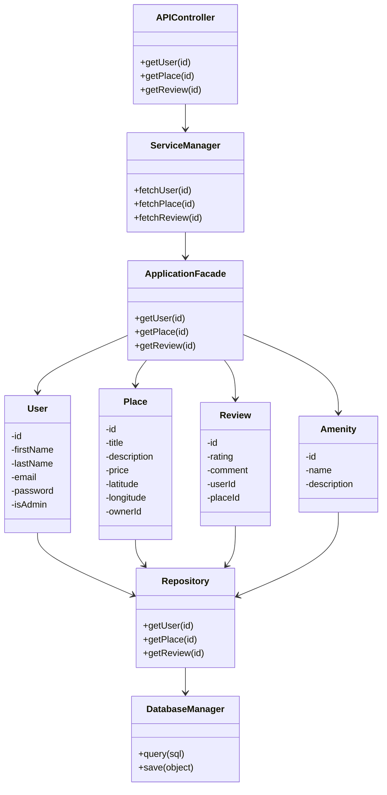
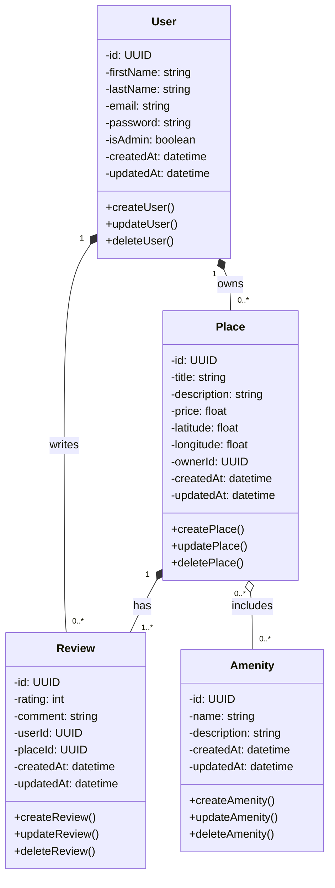
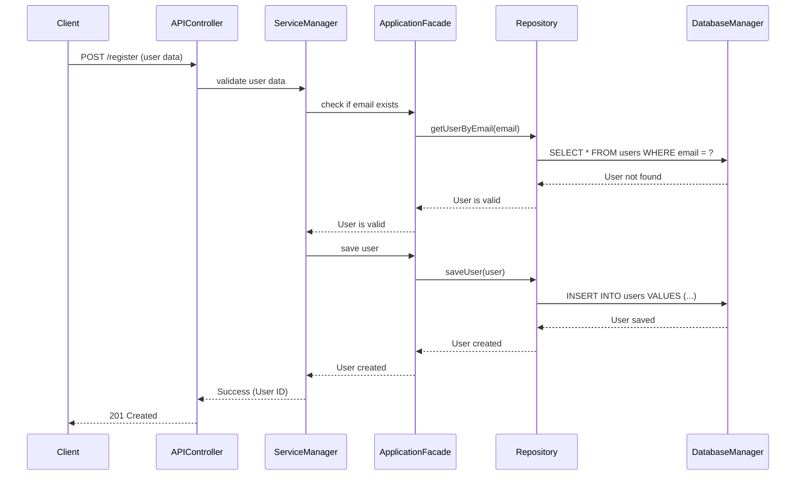
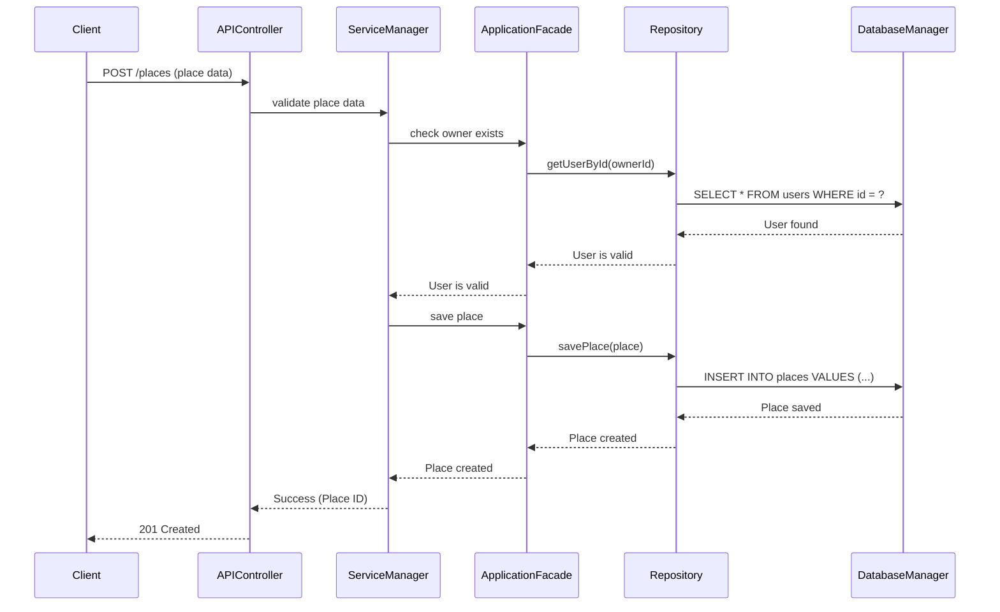
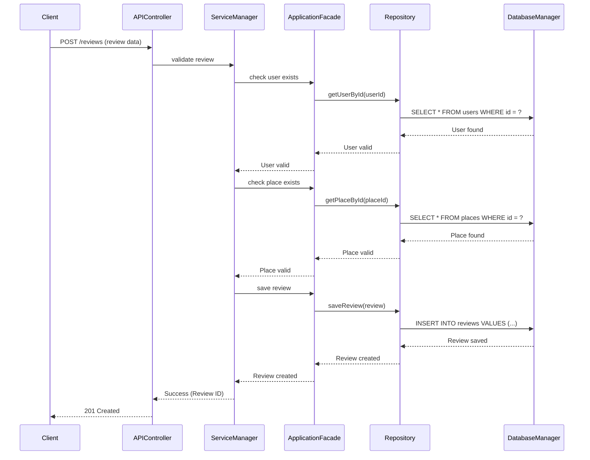
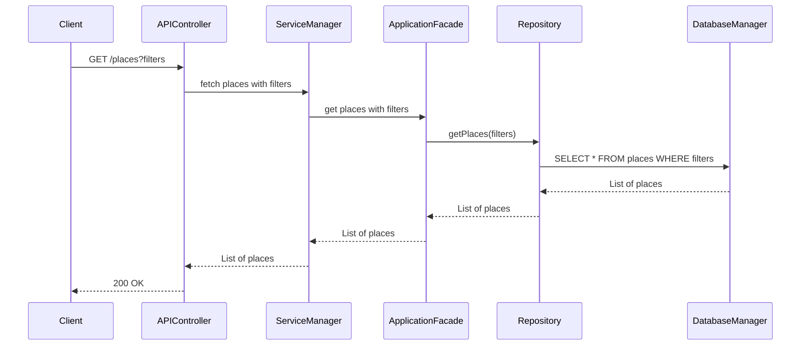

# Task 0

**High-Level Package Diagram for HBnB Evolution**

## **1. Context and Objective**

In this initial phase, we are focusing on creating comprehensive technical documentation that serves as the foundation for the development of the **HBnB Evolution** application. This documentation provides an understanding of the overall architecture, the detailed design of the business logic, and the interactions within the system.

## **2. Problem Description**

The HBnB Evolution application is a simplified version of an AirBnB-like system, allowing users to perform key operations:

### **2.1 User Management**

- Users can **register, update their profiles, and be identified** as regular users or administrators.
- **Attributes**: First name, last name, email, password, admin status (boolean).
- **Operations**: Create, update, delete users.

### **2.2 Place Management**

- Users can **list properties (places) they own**, specifying details such as name, description, price, and location (latitude & longitude).
- Places are **associated with their owner**.
- Places can have a **list of amenities**.
- **Operations**: Create, update, delete, list places.

### **2.3 Review Management**

- Users can **leave reviews** for places they have visited, including a rating and a comment.
- **Operations**: Create, update, delete, list reviews by place.

### **2.4 Amenity Management**

- The system **manages amenities** that can be associated with places.
- **Attributes**: Name, description.
- **Operations**: Create, update, delete, list amenities.

### **2.5 Business Rules**

- Every object is **uniquely identified** by an ID.
- **Audit logging**: Creation and update timestamps must be recorded for all entities.

---

## **3. Three-Layer Architecture**

The application follows a **layered architecture**, consisting of:

### **3.1 Presentation Layer** (User Interaction)

- This layer includes **services and API endpoints** exposed to users.
- Responsible for handling **HTTP requests, user input, and rendering responses**.
- **Key Components:**
  - `APIController`
  - `ServiceManager`

### **3.2 Business Logic Layer** (Core Logic & Models)

- Contains the **core business logic** and models representing system entities.
- Interacts with the **Persistence Layer** to fetch and manipulate data.
- **Key Components:**
  - `User`
  - `Place`
  - `Review`
  - `Amenity`

### **3.3 Persistence Layer** (Database Access)

- Responsible for **data storage and retrieval**.
- Abstracts **database operations** via repositories or DAOs (Data Access Objects).
- **Key Components:**
  - `DatabaseManager`
  - `Repository`

---

## **4. Facade Pattern Implementation**

To simplify interactions between layers, a **Facade** acts as a unified interface:

- The **Presentation Layer** interacts only with the **Facade** instead of directly accessing the **Business Logic Layer**.
- The **Facade** calls the appropriate methods from the **Business Logic Layer**, which in turn accesses the **Persistence Layer** for data.

### **Key Components of Facade**

- `ApplicationFacade` (Acts as a bridge between Presentation and Business Logic Layer)
  - Methods for managing `User`, `Place`, `Review`, `Amenity`.
  - Calls appropriate business logic methods and returns results to the Presentation Layer.

---

## **5. Package Diagram Representation**

---

## **6. Explanation of Communication Pathways**

1. A user makes a request to the `APIController`.
2. The `APIController` calls `ServiceManager` to process the request.
3. The `ServiceManager` delegates the request to `ApplicationFacade`.
4. The `ApplicationFacade` retrieves relevant data by interacting with `User`, `Place`, `Review`, or `Amenity` models.
5. These models fetch data using `Repository`, which in turn interacts with `DatabaseManager` to query the database.
6. The retrieved data flows back up the chain and is returned to the user.

---

## **7. Benefits of this Architecture**

✅ **Encapsulation** – Direct access to business logic is restricted through a single Facade.\
✅ **Loose Coupling** – The Presentation Layer is not tightly coupled to business logic, making it easier to modify.\
✅ **Simplified Interaction** – Instead of handling multiple model interactions, Presentation Layer only communicates with `ApplicationFacade`.\
✅ **Scalability** – The modular design allows easy expansion of features.

---

This package diagram provides a **clear and modular architecture** for the HBnB Evolution application, ensuring **scalability and maintainability**. 🚀

# Task 1

# Entities and Their Roles

## 1️⃣ User (User Account)
📌 **Role**: The User entity represents platform users, whether they are regular customers or administrators. Users can create property listings (Place) and write reviews (Review).

### 🛠 Key Attributes:
- **id (UUID)**: Unique identifier.
- **firstName, lastName (string)**: Personal information.
- **email (string)**: Unique login identifier.
- **password (string)**: Secure password.
- **isAdmin (boolean)**: Admin status indicator.
- **createdAt, updatedAt (datetime)**: Timestamps for record history.

### 🔹 Methods:
- **createUser()**: Registers a new user.
- **updateUser()**: Updates user profile details.
- **deleteUser()**: Deletes a user account.

---

## 2️⃣ Place (Property Listing)
📌 **Role**: The Place entity represents a property that users can list and manage on the platform.

### 🛠 Key Attributes:
- **id (UUID)**: Unique identifier for the listing.
- **title (string)**: Listing title.
- **description (string)**: Details and information about the property.
- **price (float)**: Rental price.
- **latitude, longitude (float)**: Geographical location.
- **ownerId (UUID)**: ID of the listing owner (User).
- **createdAt, updatedAt (datetime)**: Record history timestamps.

### 🔹 Methods:
- **createPlace()**: Creates a new property listing.
- **updatePlace()**: Updates listing details.
- **deletePlace()**: Deletes a property listing.

---

## 3️⃣ Review (User Review)
📌 **Role**: The Review entity allows users to leave feedback on a property they have rented.

### 🛠 Key Attributes:
- **id (UUID)**: Unique identifier for the review.
- **rating (int)**: Rating given to the property (e.g., 1-5 stars).
- **comment (string)**: User feedback message.
- **userId (UUID)**: ID of the user who wrote the review.
- **placeId (UUID)**: ID of the property being reviewed.
- **createdAt, updatedAt (datetime)**: Review history timestamps.

### 🔹 Methods:
- **createReview()**: Creates a new review.
- **updateReview()**: Modifies an existing review.
- **deleteReview()**: Deletes a review.

---

## 4️⃣ Amenity (Property Feature)
📌 **Role**: The Amenity entity represents features or services that a property can offer (WiFi, swimming pool, parking, etc.).

### 🛠 Key Attributes:
- **id (UUID)**: Unique identifier.
- **name (string)**: Amenity name (e.g., "WiFi", "Pool").
- **description (string)**: Additional details.
- **createdAt, updatedAt (datetime)**: Timestamps for record history.

### 🔹 Methods:
- **createAmenity()**: Creates a new amenity.
- **updateAmenity()**: Updates an amenity's details.
- **deleteAmenity()**: Deletes an amenity.

---

# Relationships Between Entities

## 1️⃣ Relationship: User "1" *-- "0..*" Place (A user owns multiple properties)
- A User can be the owner of multiple Place listings.
- A Place must belong to a single User (its owner).

## 2️⃣ Relationship: User "1" *-- "0..*" Review (A user writes multiple reviews)
- A User can write multiple Review entries for different properties.
- Each Review must be written by one User.

## 3️⃣ Relationship: Place "1" *-- "1..*" Review (A property must have at least one review)
- A Place can receive multiple Review entries.
- A Review is always attached to a single Place.

## 4️⃣ Relationship: Place "0..*" o-- "0..*" Amenity (A property includes multiple amenities)
- A Place can offer multiple Amenity options (such as WiFi, TV, air conditioning).
- An Amenity can be shared among multiple Places (e.g., many properties offer WiFi).

# Task 2

## 1️⃣ User Registration
### 📍 Description
This API allows a user to sign up by providing personal details (firstName, lastName, email, password).

### 🎯 Purpose of the Diagram
To visualize the interactions between the layers to validate the email and store the user in the database.

### 🔄 Interaction Flow
The Client sends a POST /register request with user details.
APIController validates the input and forwards the request to ServiceManager.
ServiceManager calls ApplicationFacade to check if the email already exists.
ApplicationFacade queries Repository, which retrieves data via DatabaseManager.
If the email is available, ApplicationFacade saves the new user.
Repository stores the user in DatabaseManager.
A 201 Created response is returned with the new user ID.

## 2️⃣ Place Creation
### 📍 Description
An authenticated user can create a new place (title, description, price, latitude, longitude, etc.).

### 🎯 Purpose of the Diagram
To illustrate how the API ensures the user exists before storing the place in the database.

### 🔄 Interaction Flow
The Client sends a POST /places request with place details.
APIController forwards the data to ServiceManager, which verifies that the ownerId is a valid user.
ApplicationFacade checks for the user in Repository (DatabaseManager).
If the user is valid, ApplicationFacade stores the new place.
Repository saves the record via DatabaseManager.
A 201 Created response is returned with the place ID.

## 3️⃣ Review Submission
### 📍 Description
A user can submit a review (rating, comment) for a place.

### 🎯 Purpose of the Diagram
To show how the system validates the user and place before saving the review.

### 🔄 Interaction Flow
The Client sends a POST /reviews request with review details.
APIController validates the request and forwards it to ServiceManager.
ServiceManager calls ApplicationFacade to verify the user exists (Repository, DatabaseManager).
ApplicationFacade then checks if the place exists.
If everything is valid, ApplicationFacade stores the review.
Repository saves the review in DatabaseManager.
A 201 Created response is sent back with the review ID.

## 4️⃣ Fetching Places
### 📍 Description
A user can retrieve a list of places based on filters (price, location, etc.).

### 🎯 Purpose of the Diagram
To illustrate how the API retrieves filtered places from the database.

### 🔄 Interaction Flow
The Client sends a GET /places?filters request.
APIController forwards the request to ServiceManager, which sends it to ApplicationFacade.
ApplicationFacade calls Repository, which generates an SQL query via DatabaseManager.
DatabaseManager returns the matching places.
The data is sent back to the client with a 200 OK response.

